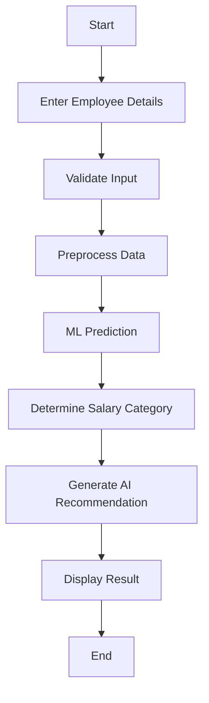
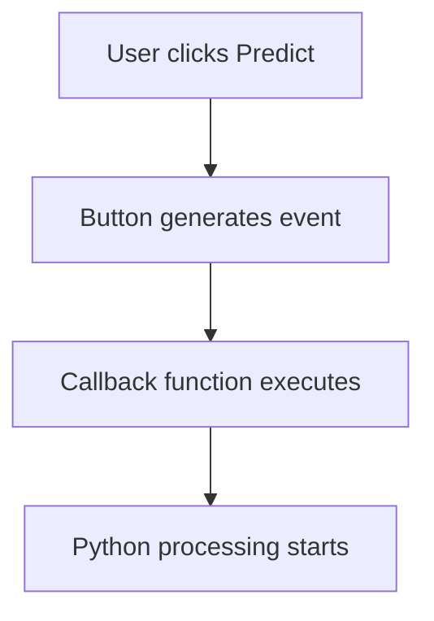
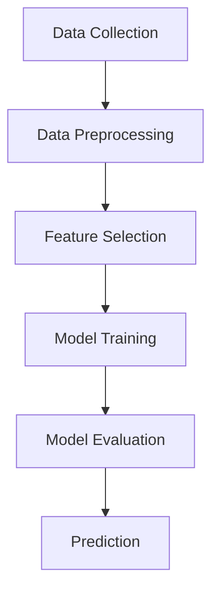

# Employee Salary Prediction and Analysis System
## 1. Problem Statement:
- Employee compensation is influenced by multiple professional and performance factors.
- HR teams may find it difficult to identify underpaid, high-risk-of-attrition employees at an early stage.
- A data-driven system can help predict an employee's expected salary band.
- The system can provide recommendations for compensation and retention actions.

## 2. Proposed Solution
- Collect employee-related information.
- Process the entered data.
- Use a Machine Learning model to predict the salary category.
- Classify employees based on predicted salary band.
- Generate intelligent HR recommendations.
- Display the results through a user-friendly Tkinter interface.

## 3. Flowchart

## 4. Project Mapping

| V-Model Stage | Employee Salary Project |
|---|---|
| Requirement Analysis | Identify employee salary prediction problem |
| System Design | Design system architecture and UI |
| Implementation | Develop Python + ML application |
| Integration | Integrate UI, ML and AI |
| Testing | Test individual modules and complete system |
| Validation | Check system against requirements |
| Demonstration | Present working capstone |

## 5. Project – Modular Application Development
### Create separate functions:
- get_employee_data()
- calculate_average()
- calculate_salary_category()
- display_result()

## 6. Requirement Analysis
### Identify the User
- Primary users may include:
- HR managers
- Compensation analysts
- Team leads
- Employees
## 6.1. Functional Requirements
### The system should:
- Accept employee details.
- Validate user inputs.
- Store/process employee information.
- Preprocess input data.
- Apply the trained ML model.
- Predict employee salary category.
- Generate recommendations.
- Display results through the GUI.
- Handle invalid inputs.
- Provide a reset/clear option.

## 6.2. Non-Functional Requirements
### The application should be:
- User-friendly
- Easy to understand
- Fast in generating predictions
- Reliable
- Maintainable
- Scalable
- Secure with respect to employee data
- Easy to test


## 7. User Requirement
### The user should be able to:
- Enter employee information.
- Submit the information for analysis.
- View predicted salary category.
- Understand the employee's retention risk level.
- Receive compensation/retention recommendations.

## 8. Identify System Inputs
### The initial system can use:
- Employee ID
- Employee Name
- Years of Experience
- Education Level score
- Performance Rating
#### Example:
- Parameter	Example
- Experience	6 years
- Education Level	78%
- Performance Rating	85%
## 9. Identify System Outputs
- Salary Category Prediction
- Very High
- High
- Medium
- Low

## 10. Additional Output
- Prediction score/probability
- Retention risk level
- Key factors affecting salary
- Recommended actions
#### Example:

- Prediction: High Salary Band
- Retention Risk: Low
- Recommendation: Maintain competitive pay and offer growth opportunities

## 11. Objective

- Understand the System Design phase of the V-Model
- Convert Day 1 requirements into a software architecture
- Design the workflow of the Employee Salary Prediction and Analysis System
- Understand GUI development using Tkinter
- Create windows, frames, labels, input fields, buttons, and message boxes
- Apply pack(), grid(), and place() for layout management
- Implement event-driven programming using button callbacks, validate user inputs
- Develop a functional Tkinter prototype.
## 12.V-MODEL


## 13. From Requirements to System Design

### Input
- Employee ID,
- Employee Name
- Years of Experience
- Education Level
- Performance Rating
  ### Processing
- validates input
- Preprocesses data
- send data to ML model,
- Generates prediction
- Generates recommendation
  ### Outputs
- predicted salary category
- retention risk level
- Recommendation.
## 14. Employee Salary Prediction and Analysis System - Testing

This folder contains the testing files for the V-Model testing stages.

## Testing Stages

### 1. Unit Testing

Tests individual modules and functions.

File:

- test_validation.py
- test_model.py
- test_csv.py

### 2. Integration Testing

Tests integration between:

- Tkinter GUI
- Machine Learning model
- n8n
- Gemini AI
- Gmail
- CSV

File:

- test_n8n.py
- test_gui.py

### 3. System Testing

Tests the major components of the complete application.

File:

- test_model.py
- test_gui.py
- test_csv.py

### 4. Acceptance Testing

Checks whether the system satisfies the required project structure and requirements.

File:

- test_requirements.py

---

## Files

```text
testing/
│
├── requirements.txt
├── README.md
├── test_requirements.py
├── test_validation.py
├── test_model.py
├── test_csv.py
├── test_n8n.py
└── test_gui.py
```


  

## 15. Proposed System Architecture

Employee Details → Validation → Preprocessing → ML Model → Salary Category + Risk → AI Recommendation (Gemini) → Email (Gmail via n8n) → Display + CSV Log

## 16. UI Design Requirements

The application should contain
### 1. Employee Information Section
- Employee ID
- Employee Name
### 2. Professional Information Section
 - Years of Experience
 - Education Level
 - Performance Rating
### 3. Action Section
 - Predict Salary
 - Clear
 - Exit buttons
### 4. Result Section
 - Retention Risk
 - Recommendation.
## 17. Using Frames
### The main window:
- Header frames
- employee information
- professional information
- Header frame
- Results frame
## 18. Workflow

## 19. Requirements Design
Same 900x650 / 1200x800 Tkinter grid-based layout as the prototype, split into
Employee Information, Professional Information, Action buttons, and Predicted Result sections.

## 20. Objective
- Understand the fundamentals of Machine Learning (ML)
- Differentiate between traditional programming and ML-based systems
- Work with datasets using Pandas & NumPy
- Perform data preprocessing and feature selection
- Train a Machine Learning model for prediction
- Evaluate model performance using basic metrics
- Replace Day 2 rule-based logic with an ML-based prediction system
- Prepare the ML model for integration with Tkinter UI

## 21. OUTCOMES
### Should complete:
- Dataset (CSV file)
- Data preprocessing code
- Trained ML model
- Accuracy report
- Prediction function
- Saved model file (.pkl)
## 22. Traditional Programming vs ML

| Traditional Programming | Machine Learning |
|---|---|
| Rules are written manually | Model learns rules from data |
| Output = Logic + Input | Output = Model + Input |
| Fixed logic | Adaptive learning |
## 23. ML Workflow

## 24. ML WORKFLOW
### Activity 1 – Dataset Creation
Create employee dataset in CSV
Add 20–50 records
### Activity 2 – Data Loading
Load dataset using Pandas
Display dataset
### Activity 3 – Data Cleaning
Remove missing values
Check data types
### Activity 4 – Model Training
Train Logistic Regression model
Split dataset
### Activity 5 – Model Evaluation
Calculate accuracy
Analyze results
### Activity 6 – Prediction
Test model with new input
### Activity 7 – Save Model
Save model using Joblib
## 25. Problem Type
### For this Project:
- Classification Problem
### Output categories:
- Very High
- High
- Medium
- Low
### Regression Problem (Alternative)
- Output = Actual Salary Value (numeric)
## 26. Model Selection
### Algorithms Introduced
- Logistic Regression
